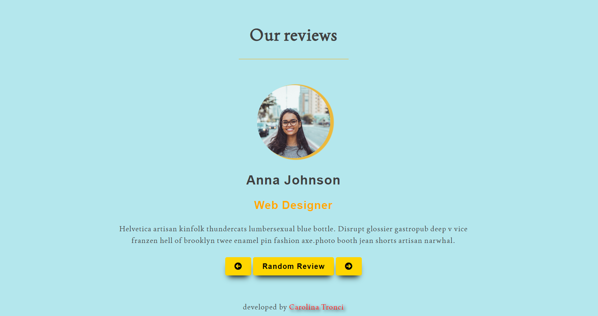

# Frontend Mentor - Reviews project
-This is a challenge from FreeCodeCamp-

## Table of contents

- [Overview](#overview)
  - [The challenge](#the-challenge)
  - [Screenshot](#screenshot)
  - [Links](#links)
- [My process](#my-process)
  - [Built with](#built-with)
  - [What I learned](#what-i-learned)
  - [Continued development](#continued-development)
- [Author](#author)

**Note: Delete this note and update the table of contents based on what sections you keep.**

## Overview

### The challenge

Create a page that display some reviewers of users. There must be arrows to scroll through the reviews and a button to show a random review.

### Screenshot



### Live site

- Live Site URL:[https://bubu2323.github.io/reviews/]

## My process

### Built with

- Semantic HTML5 markup
- CSS custom properties
- Flexbox
- Primitive Framework
- Mobile-first workflow

### What I learned

I learned to use an object from which to take data and manipulate it. It took me some time to manage the counter when it needed to come back.
I also added a function to make the first letters of the name and the job uppercase using a regEx.
For the style part I found a way to make all images the same size (see code below).
It was an interesting and challenging project.

```css
img.img_rew {
  width: 10em;
  height: 10em;
  object-fit: cover;
}
```

yone viewing your solution or for yourself when you look back on this project in the future.\*\*

## Author

 [Github Profile](https://github.com/bubu2323)

**Note: Delete this note and add/remove/edit lines above based on what links you'd like to share.**
